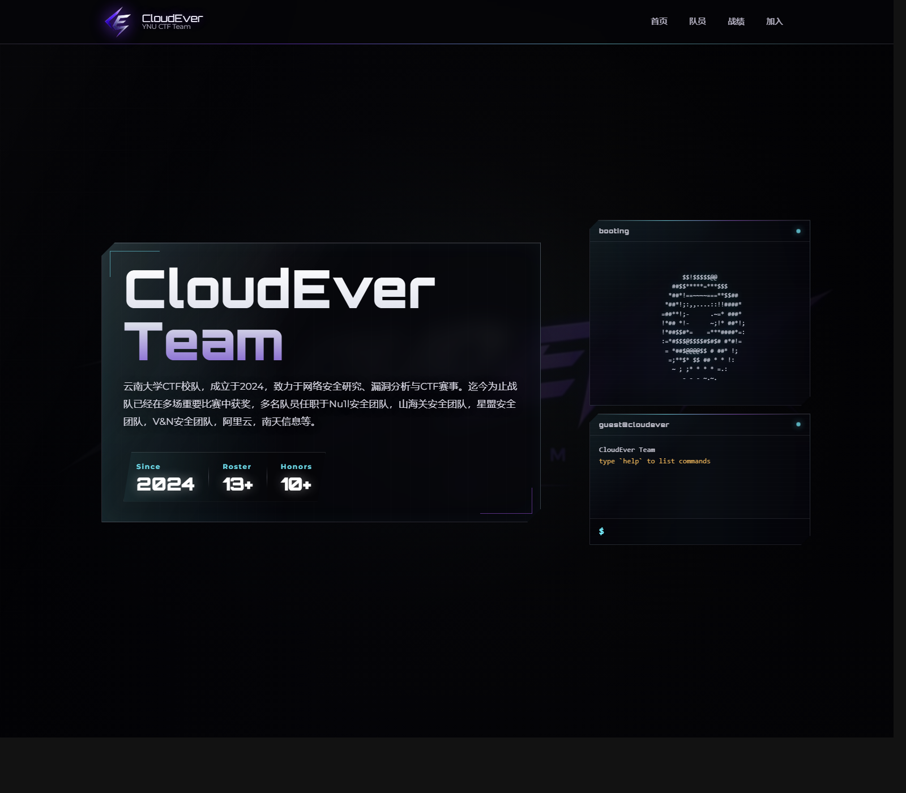

# CloudEver CTF 战队官网

<div align="center">
  
</div>

云南大学 CTF 校队，成立于 2024，致力于网络安全研究、漏洞分析与 CTF 赛事。战队成员持续活跃在校内外比赛、公开赛事与安全社区中。

本仓库是 CloudEver 新官网源码。

**官网地址**：[https://cloudever.top](https://cloudever.top)

## 官网亮点

- 全新的 HUD 风格首页，首页右侧集成可交互终端。
- 单页展示战队介绍、核心队员、荣誉战绩与加入方式。
- 静态站点部署简单，资源全部随仓库分发。

## 神秘的 WASM 在线 Linux 虚拟机

新官网首页右侧的终端不只是装饰。输入 `linux` 后，页面会直接在浏览器里启动一个基于 `v86 + WebAssembly` 的 Linux 环境，并把串口控制台接到页面终端上。

- 这不是后端容器，也不是远程 SSH，而是前端本地启动的 x86 仿真环境。
- 运行时依赖放在 `assets/v86/`，包括 `v86.wasm`、BIOS、VGA BIOS 和内核镜像。
- 启动逻辑写在 `js/team.js`，输入 `exit-linux` 可以退回 CloudEver 自带的 shell。
- 由于浏览器安全限制，这个功能需要通过 `http://` 或 `https://` 访问页面，不能直接双击 `index.html` 用 `file://` 打开。

## 本地预览

```bash
python3 -m http.server 8000
```

然后访问 [http://127.0.0.1:8000](http://127.0.0.1:8000)。

## 目录结构

```text
cloudever.top/
├── assets/v86/    # wasm Linux 运行时、BIOS 与内核镜像
├── css/           # 样式文件
├── images/
│   ├── demo/      # README 预览截图
│   └── user/      # 队员头像
├── js/team.js     # 队员数据、终端与 wasm Linux 启动逻辑
├── index.html     # 主页
└── README.md      # 项目说明
```

<div align="center" style="color: #888;">
  &copy; 2025-2026 CloudEver Team. All rights reserved.
</div>
